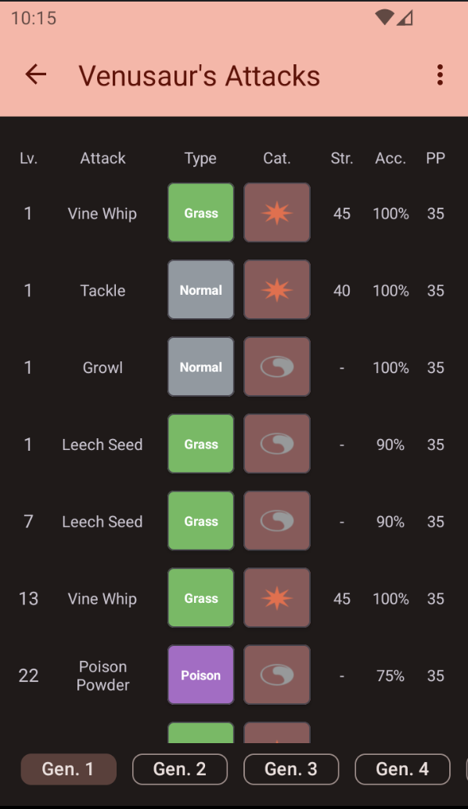
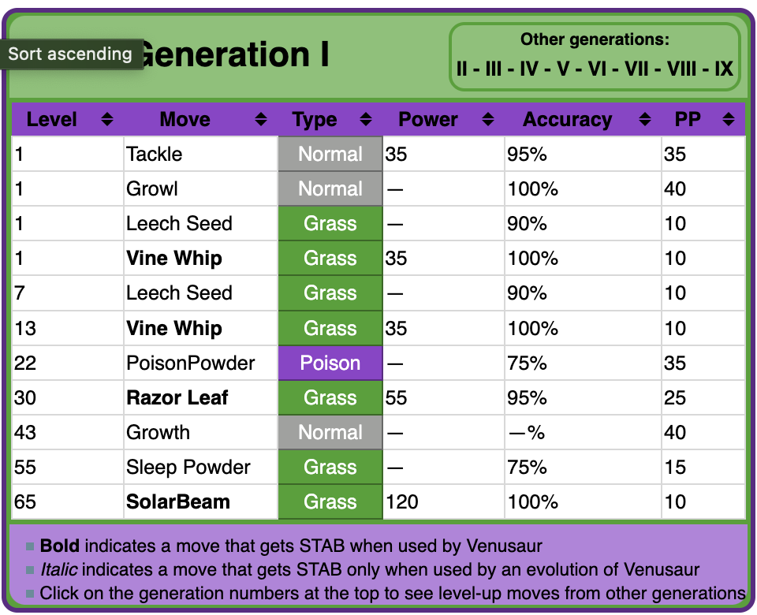
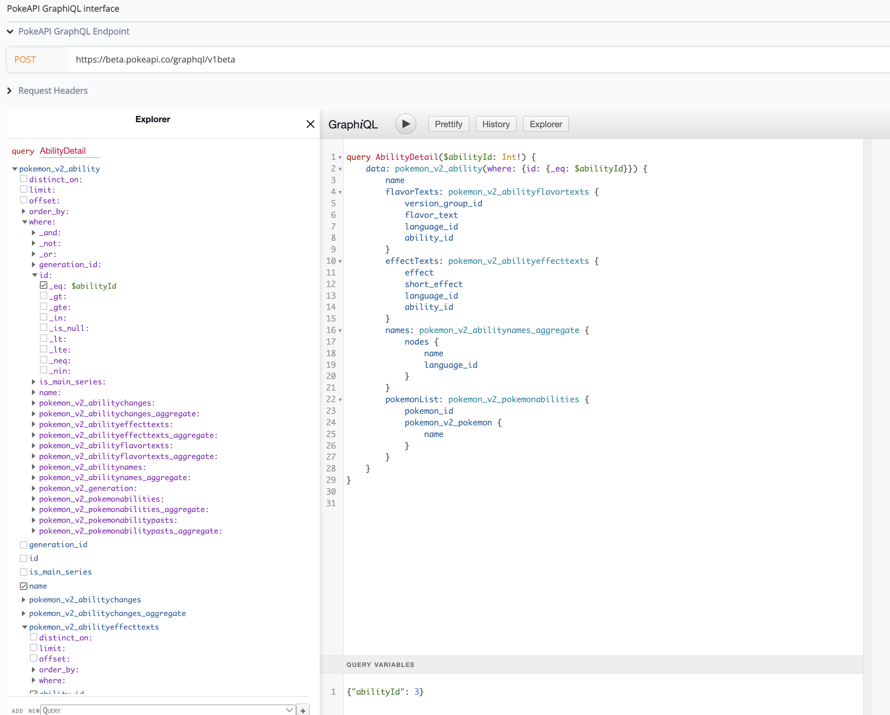

# Poke-Info: A Journey into Pokémon and Android Development

Here is a download link for the apk if you just want to test what the app would look alike.
https://drive.google.com/file/d/1-3i2khSg2HMv9KKWOX0xlXmHrhK0deul/view?usp=drive_link

In this release build the database is prefilled so there are way less api calls, only Pokemon Attacks and Abilities are getting fetched.

Welcome to Poke-Info! This app was created as a personal project for self-education in mobile development and a deeper understanding of the Pokémon universe. The primary goal here is learning and exploration, not commercial gain. All data used within the app respects copyright and fair use policies. As this Project is a 1-Man-Project it contains propably a lot of unusual things that might be confusing. 

# Alternative Version in Compose available ( not even quite finished, in work )
https://github.com/PhilippTiropoulos/Poke-Info-Compose.git

## About the Project

Poke-Info is an Android application designed to provide a comprehensive look into the vast world of Pokémon. It serves as a tool for fans and developers alike to explore Pokémon data and experiment with team building strategies.

### Educational Purpose

The development of Poke-Info is driven by a desire to understand the intricacies of Android development, from managing data and interfacing with APIs to creating a user-friendly mobile experience. This project is open-source, intended for educational purposes, and I have no intention of infringing on any copyrights.

### Data Storage and Management

One of the core features of Pok-Info is its approach to data storage. The app utilizes local data storage to minimize API calls and ensure quick access to Pokémon information. This approach not only makes the app more efficient but also adheres to the fair use policy by reducing the load on external data sources.

### TeamBuilder: Crafting Your Pokémon Team

The TeamBuilder feature allows users to assemble and save their ideal Pokémon teams. This tool is designed to enhance the strategic aspect of Pokémon and provide a personalized experience. Users can experiment with different team compositions and save their favorite lineups for future reference.

## Do you want to "check" the correctness of the values?

Due to PokeApi is a free API, there is no guarantee that the details the api has, are 100% correct. But especially for older Pokemon you
can check Websites like https://bulbapedia.bulbagarden.net/wiki/Venusaur_(Pok%C3%A9mon)/Generation_I_learnset#By_leveling_up

In general to make sure that all what is displayed is legit and correct I had to compare the values with the exact JSON / GraphQL answers, which can be kind of work.

Example: Venusaur

Compared to

### How I used GraphQL

GraphQL is a interface to make it easier to understand how the Data of the Pokemon API is "built" and organized.
My Project also used ApolloClient to use this interface to retrieve data with a query to just request exactly the Data needed to display.
In the Screenshot there is a lightweight Query to show how the Details for a single Ability is fetched.

### Integration with Firebase

Pok-Info integrates with Firebase to offer a seamless and scalable backend solution. This includes user authentication, data storage, and real-time database interactions. Firebase's robust platform supports the app's data-intensive features while ensuring user data is handled securely and efficiently.

## Contribution and Feedback

As an educational project, Poke-Info welcomes contributions and feedback from the community. Whether it's suggesting new features, reporting bugs, or improving the codebase, your input is invaluable in making Pok-Info a better tool for everyone.

## How to use the App yourself

To make this app work, you need to create your own Firebase Project (you need a google account for that)
